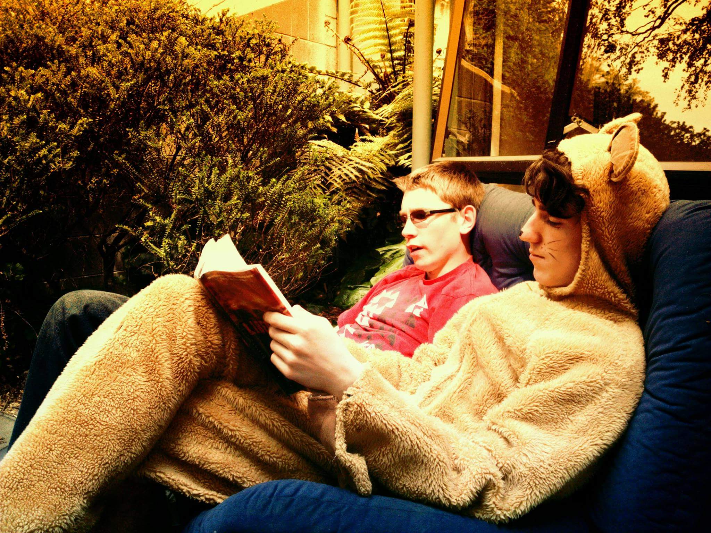

# Power & Learning

I estimate state education has set my technical ability as a coder back about a decade.
This is annoying, but I think I now have my finger on a core thread that I really needs pulling.

I value conciseness so here's what I think the essence of it is: 
> power dynamics hamper learning; what a waste of potential.

There's a chance I'm wrong. Here's my story if you want to parse it yourself.

---

As an inquisitive (and naive) teenager, I judged IT largely by what was offered at school.
Touch typing, some html maybe, but none of the really beautiful stuff.
The offering was boring and unchallenging compared to centuries-old maths and sciences. 

My inquiry led me to study neuroscience, which turned out to be a bit too reductionist to practically help me understand people (so western!).
I graduated as a mathematician, and after failing as a post-graduate research assistant (modelling blood splatter of blunt weapon trauma), I took a government subsidy to train as a teacher. 

I'd really enjoyed tutoring at university, but found that my higher education on education guided me into surprisingly unsavoury amounts of acting (playing some autoritarian role) and crowd control (learning tricks to manipulate group social dynamics to maintain control).

I didn't care about the length of hair or the height of socks.
Quiet (but noticed) protest looked like attending careers day and meeting prospective school principles in ripped jeans.
I didn't bother graduating, and was forced to get a special note to teach - apparently graduating _in absentia_ involves more formal opting out than not showing up for the ceremony.

The irony of teaching engaging learning in a lecture format was a laugh, but the university did introduce me to [Ao Tawhiti Unlimited Discovery](http://aotawhiti.school.nz/) - the only highschool I would take a job at.
This wasn't an act of rebelion, more an extension of my stubornness and pickiness (which I was rich enough to be able to afford).

What was so attractive about Unlimited was the atmosphere (or people dynamics).

Unlimited is a state funded public secondary school that exists because of a loophole in the law, which allowed the bending of a rule meant for the integration of church schools into a rule which allowed the school to write its own assessment rules.
Its "special character" is "a fundamental tenet that the child is central in directing his or her own learning so that the enthusiasm and love of learning is retained."
My kind of place.

I can talk a lot about what made that environment transformative, but I think the key was radically more equal power dynamics.
As a Learning Advisor there, I didn't assert authority through enforcing arbitrary rules.
I had conversations on a first name-basis with people about what they cared about in life.
Classes didn't have age-barriers, and students could choose what they wanted to do every 5 weeks.
Instead of segregation and age-based hierarchy, there was conversation and experiementation.

It felt good.
People were kind (not to be confused with nice), and they learnt a lot.
Instead of negotiating bullying and claustrophobia, students spent their time doing things like attending university level classes, running New Zealand's only openDNS server from a bedroom, and working together to support a friend with depression.
Some of the experiences moved me so deeply I still cry when I recall them.

Most state education is missing the mark by a wide margin. It makes me thoroughly sad - and angry.

---

I loved Unlimited, and learnt an enourmous amount there, but I left to stretch skills outside of teaching.
There was also a massive earthquake that destroyed the city.
I moved to attend art school, where I got into programming the laser cutter (which I was shocked to find almost no one else was using). 

 in construction")

I was the worst adult student - I know what good education looks like, and I like giving feedback.
The context and tools were great but the educators (ourside of the pure theorists) were weak.

I left and did some relief teaching where I tried to treat students as equals.
I was horrified to discover that the acting I'd disliked in state teaching is a two part play, and exiting a play is hard when the other actors are continually asserting your role.
Genuine conversation was overridden by a race to establish dominance and control.

Over a summer break I was introduced to Joshua Vial taught me (and several others) to be web developers.
I applied took these skills helped build Loomio (an open source collaborative decision-making tool).

The people of [Loomio](http://www.loomio.org)  - and the garden-nebula Enspiral within which is grew - were the next group of most excellent people I met.
This is where I was introduced more excplicitly to a discourse around power.

---

Now, I'm now a teacher at [Enspiral Dev Academy](http://www.devacademy.co.nz), a coding bootcamp that trains non-techinical people to become junior web developers in 9 weeks.
It's a synthesis of my interests to date - programming, learning, and community building.

I take myself, and those around me to and beyond the limit of our technical ability.
The only way you can do that effectively and get anything out of it is to be super up-front about what you do and don't understand.

Not knowing things for some reason brings up shame for people.
The most dangerous thing for a student is self-doubt, and sitting on shame is a good way to get that.
This is another topic I'm currently really interested in, and will write more on some time.

Right now I'd like to focus on how _not knowing_ plays out for teachers.
I believe at the heart of this is the reason I'm not currently an ascendant cyber-wizard.

I think that might be a study in itself, but I'm more interested in how _not knowing_ plays our for teachers, because I believe this is the reason I'm not currently an ascendant cyber-wizard.

When you don't know a thing as a teacher, a **very interesting** decision path emerges : 

A) lie

B) admit you don't know

## Why would you lie?

Well, if your position as teacher is predicated on your knowing more, being the _source of truth_ , then not knowing might seem to undermine that.

The average high-school teacher is in a surprisingly precarious power-position - it might look like they have control, but only through carefully guided consent of the class.

For a teacher in a position where their authority is coupled to their knowledge, it is awefuly appealing to steer conversation away from topics which might erode that position.

I think this is why classes on computers suck so bad in highschool - they are born of institution, which is established in such as a way as to bind teaching to the bounds of individuals mastery, which is finite.

Education around computers offer a unique window into the future of learning - the field is moving so fast, that **the only reasonable path is to say "I don't know"** a lot.
If you don't, then talking about new and relevant ideas won't be part of your curriculum.

But in many educational institutions, saying I don't know is not safe for educators.
Generally they are in systems that give them positional authority to solve the 'behaviour management' problems.
They are generally not afforded humanising tools of social safety, like building genuine relationships, or sharing vulnerability.

This does everyone trapped in that dynamic a huge disservice.
Both teachers and students achieve less understanding, less empathy, less collaboration, less critical thinking, etc.
The learning is poorer.

Being able to say "I don't know" is the beginning of some fantastic cascading effects:
- reveals 'students' and 'teachers' both as learners
- opportunity to model good learning
  - critical thinking / problem solving (process over wrote learning)
  - asking for help
  - listening
- shows teacher as human, relateable
  - more trust, less lying
  - more humanistic dynamic, better conversations
- drop shame, move to a growth mindset
- go beyond boring 'safe' topics
  - interesting, inspiring
  - engaging (perhaps people like me 15 years ago)
- play

This is how I see power dynamics  hampering our learning.

I'm investing in education systems which set aside positional authority, and foster environments in which it's safe for everyone to be vulnerable.
For older systems, I'm building an evolving book format, designed to open education resources and support teachers to transition from authorities to guides and catalysts of learning.

My colleagues and I would love to hear from anyone also playing the long-game of reshaping education.

