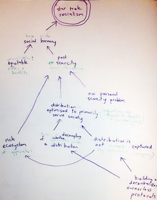

On the road to the Galactic Council
===================================

I've hosted two workshops this year where the highest named goal was humanity joining the Galactic Council. 

So I hang out with a bunch of big dreaming nerds with a bunch of different interests, but when we explore what it is we want in our future, it's a happy thriving civilisation. You'll know we're there because we'll be looking after each other, curiously exploring, sharing our successes, and making intergalactic friends.

The workshops were about developing a Theory of Change for each group. 

+[What is theory of change](./fragments/_theory_of_change.md)

In each workshop, 2 hours of conversation made barely a dent in completing a fully detailed map, but we'd revealed a lot of territory.

Workshop 1 : Is our work climate change work? 
---------------------------------------------

[details to follow]

Workshop 2 : Why build a decentralised database?
------------------------------------------------

Here's what the top of our theory of change diagram looked like :

If we start with our highest value and back-cast through our dominant arc of dependencies, it reads :

1. Galactic council
2. Civilisation-wide social harmony
3. Post scarcity
4. Distribution primarily in service of society 
5. Distribution is distributed and un-ownable
6. We build our distribution on un-capturable technologies

We tested our thinking about distribution problems against several real-world examples

- distribution of food and goods: supermarkets, wal-mart
- distribution of information: email, google, facebook

We observed that ownership of distribution by actors mainly interested in profit has lead to problematic dynamics which block us from joining the Galactic Council. See massive food waste, destruction of diversity through monopoly, development of tools which optimise addiction and consumption, development of tools which define value for us.

Here's a breakdown of a couple of interesting cases in the context of information.

### Email

Email is a super successful open protocol. Anyone can send emails to anyone. The failing of email is that it has no mechanism for dealing with un-wanted noise (see spam).
This has generated a niche for organisations to offer value (spam filtering), and capture users. 
For example Gmail is popular because it does fairly reliable spam filtering. This makes email less open, because small private servers have a harder time generating a good 'not-spam' reputation.

**Distribution systems must have a solution to noise.**

### Facebook

Facebook is built on an open protocol - http - but has centralised closed databases, and a closed (proprietary) interface.
Facebook's primary motivation is profit, which inclines it to leverage it's closed-ness (right of refusal of access) to extract value from it's user-base. 

**Open protocols are not sifficient to ensure as uncapturable distribution system.**

_[facebook ToS](https://www.facebook.com/terms.php)_

### Google

As the web grew, so did the need for a means to find things more easily. Search engines have filled this niche and Google now dominates the definition of what a valuable search result is. Again, Google is primarily motivated by profit, so this is a problematic arrangement.

**Distribution systems need to address searchability**  

---

Secure Scuttlebutt
------------------

The [Secure Scuttlebutt](https://github.com/ssbc) project attempts to address these core challanges of distribution by design, noise, and searchability. 

The latter two are addressed by establishing a network of trust around each user - opting into following relationships demonstrates 'trust' (or at least value of content another user is producing). Content is then distributed by 'gossiping' with trusted peers. This mitigates distribution of unwanted content.
Similarly moderation is achieved in a distributed way by sharing information about flagging inappropriate through the trust-network.

Check out an email / twitter replacement that impliments all of this using the Secure Scuttlebutt core, it's called [Patchwork](https://github.com/ssbc/patchwork).

The following is some more detailed info from the Secure Scuttlebutt Docs page:

+[Secure Scuttlebutt Docs](https://github.com/ssbc/docs)

