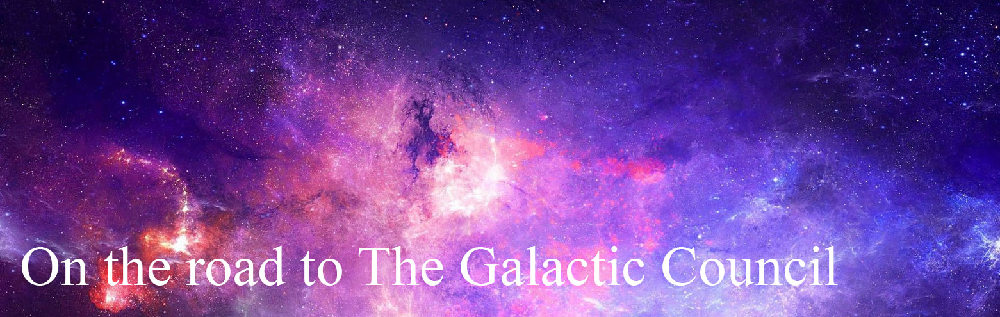

I've hosted two workshops this year where the highest named goal was humanity joining the Galactic Council. 

So I hang out with a bunch of big dreaming nerds with a bunch of different interests, but when we explore what it is we want in our future, it's a happy thriving civilisation. You'll know we're there because we'll be looking after each other, curiously exploring, sharing our successes, and making intergalactic friends.

The workshops were about developing a Theory of Change for each group. 

+[What is theory of change](./fragments/_theory_of_change.md)

In each of the workshops, 2 hours of conversation made barely a dent in completing a fully detailed map, but we'd revealed a lot of territory.
Both workshops explored similar viens, but here I'll explore the second, because it's fresher in memory and highly relevant to my current work.

Workshop 2 : Why build a decentralised database?
------------------------------------------------

+[Theory of change: Secure Scuttlebutt](./fragments/_theory_of_change_secure_scuttlebutt.md)

